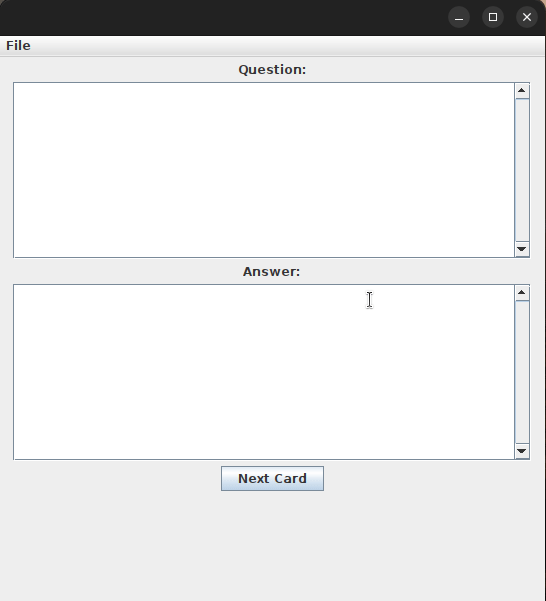
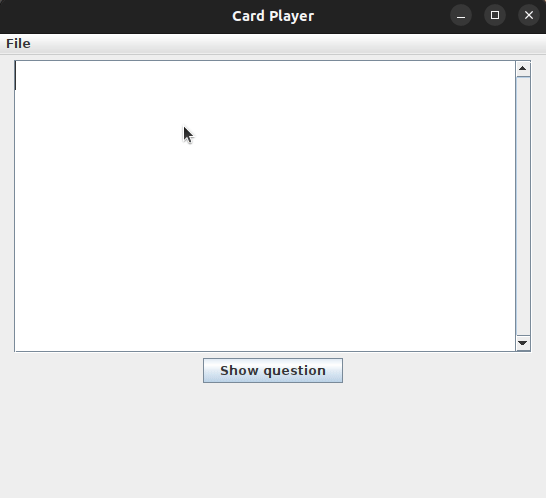

# CardBuilderPlayer: Java Flash Card Desktop Game  

*Work in progress, contributions are appreciated!*
## Overview
CardBuilderPlayer is a Java-based desktop application designed for creating and playing with flash cards. This project comprises two main components:
1. ### Card Builder ([CardBuilder.java](src/CardBuilder.java)):
   - Easily construct personalized flash cards with text and images.
   - Save the created cards for future reference and use.

  

2. ### Card Player ([CardPlayer.java](src/CardPlayer.java)):
   - Load and engage in interactive quiz sessions with flash cards created using the Card Builder.
   - User-friendly interface for an enjoyable learning experience.

  
## Key Features
- Create custom flash cards with both text and images.
- Save and organize flash cards for various subjects or topics.
- Load saved flash cards and initiate quiz sessions for effective learning.
- Intuitive user interface for seamless navigation and interaction.
## How to Use
1. ### Building Cards:
   - Execute CardBuilder.class to access the card-building interface.
   - Craft new cards, add content, and save them for future use.
2. ### Playing Cards:
   - Run CardPlayer.java to start the flash card game.
   - Load saved cards and embark on quiz sessions to reinforce your knowledge.
## Getting Started
Clone this repository to set up your CardBuilderPlayer. Open the repository folder with your favorite IDE and start building and playing with your flash cards.
## Dependencies
- Java SE Development Kit (JDK)
## Contributing
Contributions are encouraged! Feel free to open issues or submit pull requests for improvements or bug fixes.
